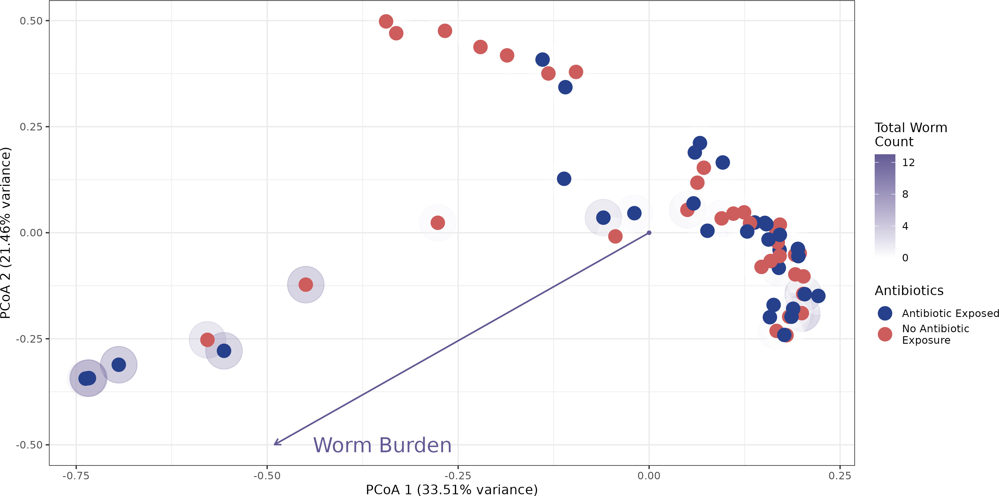
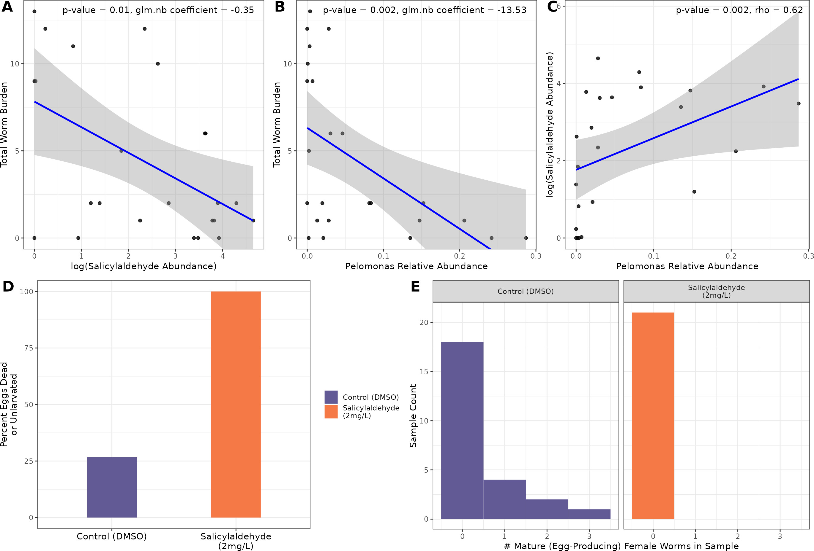

# Investigating Gut Microbiome-Mediated Parasite Infection in Zebrafish

## Overview

This repository explores the dynamic interactions between gut microbiota, chemical metabolites, and intestinal helminth infection in zebrafish. Our study highlights how the taxonomic composition of the gut microbiome correlates with worm burden and identifies chemical mediators driving these relationships. The bacterium *Pelomonas* emerges as a key player, modulating levels of salicylaldehyde, a compound shown to possess potent anthelmintic properties. Experimental validation further underscores salicylaldehyde’s therapeutic potential.

## Key Insights

Analysis of the zebrafish gut microbiome revealed that parasite worm burden correlates significantly with microbial community composition. The Bray-Curtis dissimilarity matrix and PERMANOVA tests demonstrated that the taxonomic makeup of the microbiome aligns with infection levels, implicating specific microbes in modulating infection outcomes.

*Figure 1: The taxonomic composition of the gut microbiome correlates with parasite burden.*

Among the gut microbes, *Pelomonas* plays a central role, influencing levels of salicylaldehyde, a metabolite inversely correlated with worm burden. This association bridges microbial ecology with chemical interactions, providing mechanistic insight into the microbiome’s role in parasite regulation. Experimental testing validated salicylaldehyde’s anthelmintic activity, demonstrating its ability to reduce parasite egg viability and burden in vivo.

*Figure 2: Salicylaldehyde shows potent anthelmintic effects in zebrafish models.*

---

## Code Descriptions

### beta_div_and_plot.R
This script calculates beta diversity metrics, performs principal coordinates analysis (PCoA), and runs PERMANOVA tests to examine relationships between gut microbiome composition, worm burden, and antibiotic treatment. The results provide insights into how community-level microbiome changes are associated with infection and treatment effects.

### custom_functions.R
Contains reusable functions for statistical tests and analyses, including generalized linear models for identifying associations between gut microbiota and worm burden, as well as Adonis tests for metabolite and microbiome interactions.

### initial_processing.R
Processes raw data, including 16S rRNA sequences and metabolite profiles. It cleans and transforms the phylogenetic data, identifies biologically meaningful metabolites, and prepares the dataset for subsequent statistical and mediation analyses.

### process_med_and_plot.R
Identifies microbial taxa and metabolites associated with worm burden through mediation analysis. It evaluates direct and indirect effects of metabolites on parasite burden, leveraging parallel computing to enhance performance for large datasets.

### RF_analysis.R
Implements a random forest model to identify the most predictive ASVs (amplicon sequence variants) for worm burden. It also calculates variance explained by the model and visualizes the top ASVs contributing to parasite infection outcomes.

### sal_and_pelo.R
Explores the relationship between *Pelomonas*, salicylaldehyde, and worm burden. The script visualizes associations through scatterplots and validates the role of salicylaldehyde as an anthelmintic compound, integrating experimental data on its effects on parasite viability and reproduction.

---

*This repository offers a comprehensive framework to explore gut microbiome-parasite interactions, from data processing to statistical analysis and visualization.*

